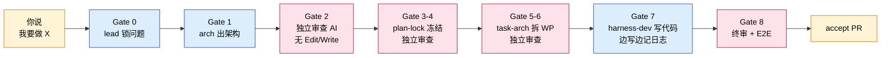
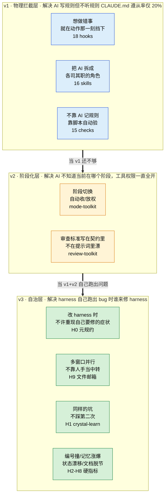

# wow-harness 在 Towow 的实践

> **本地展示**：双击打开 [`docs/practice.html`](./practice.html)（浅色主题，纯 HTML+CSS，不依赖任何渲染引擎）。
> 下面是同一份内容的 GitHub 在线版本（Mermaid 渲染）。

98 天 / 2058 commits / 76 万行 / 2100+ 测试 — 一个人 + AI 全自主交付。
两张图是 harness 当前真实在跑的样子。

---

## 图 1 · 你说一句话，AI 自己干完 8 关

- 黄色 = 你的输入 / 你的决策
- 蓝色 = AI 执行（lead / arch / dev）
- 红色 = 独立审查 AI — 不共享之前对话从头看；tools 列表里物理移除 Edit / Write，**不是嘱咐它「只看不改」，是它根本调不出这两个工具**

---

## 图 2 · 三层 harness — 每层在解决什么问题

每层都在答一个问题：「上一层不够用的时候补什么」。
- **v1 解决** AI 写规则但不听规则（CLAUDE.md 遵从率仅 ~20%）→ 用 hook 物理拦截
- **v2 解决** AI 工具权限一直全开 → 用阶段机自动收/放权
- **v3 解决** harness 自己跑出 bug → 9 站自治协议（修问题不在自己交付物里重现该问题等）

**v3 一直闭合不再开新站，本身就是稳态信号。**

---

## 想直接看实现的话

| 你想看 | 打开这个 |
|---|---|
| 审查 AI 物理上改不了代码 | [`.claude/plugins/towow-review-toolkit/agents/reviewer.md`](../.claude/plugins/towow-review-toolkit/agents/reviewer.md) — 看顶上 `tools:` 列表 |
| ADR 编号撞了 git 直接拒绝提交 | [`.githooks/pre-commit`](../.githooks/pre-commit)（22 行 shell）+ [`scripts/checks/check_adr_plan_numbering.py`](../scripts/checks/check_adr_plan_numbering.py) |
| AI 之间怎么传消息（H9 邮箱） | [`.towow/inbox/schema/message-v1.json`](../.towow/inbox/schema/message-v1.json) + 5 个 inbox hook |
| 16 个 skill 怎么分工 | [`.claude/skills/`](../.claude/skills/) |
| 所有 hook IO schema | [`scripts/hooks/_hook_output.py`](../scripts/hooks/_hook_output.py) — 16 个 helper API（ADR-058） |
